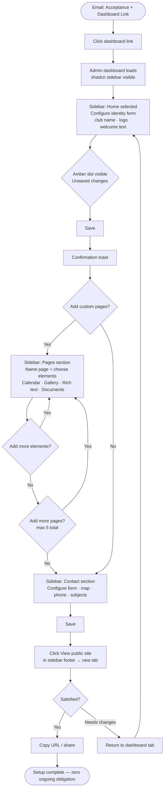
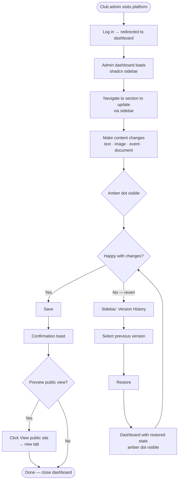
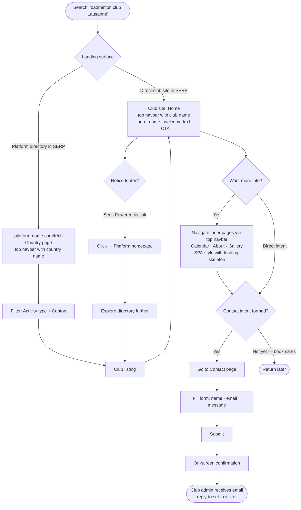
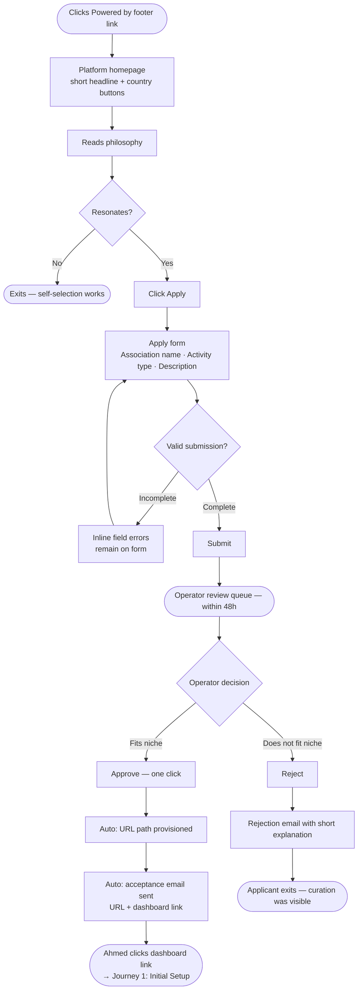
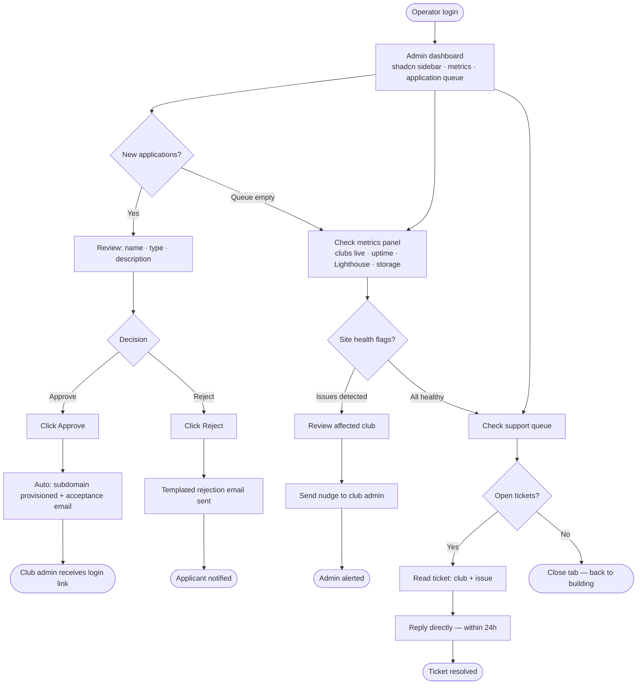

# UX Design Specification website-template

**Author:** Clashware
**Date:** 2026-02-25

---

<!-- UX design content will be appended sequentially through collaborative workflow steps -->

## Executive Summary

### Project Vision

A hosted website builder for non-profit community associations — ski clubs, sports clubs, music clubs — built around a philosophical inversion: the platform owns style permanently, associations own content permanently. Associations set up their site once and stop thinking about it. The platform absorbs all design, infrastructure, and upgrade complexity, silently, forever. The measure of success is not engagement — it is people finding a club and showing up.

### Target Users

**Club Admin** — non-technical volunteer (often a club president or secretary, 40–60s). Time-poor. Sets up the site in one session, then makes infrequent content updates. Needs zero ambiguity, zero risk of breaking things, and zero ongoing maintenance obligation. Primarily desktop for initial setup; mobile must also work for edits.

**Public Visitor** — person searching for a local activity (often recently relocated or newly motivated). Mobile-first. Discovers clubs via search engines or the platform directory. Needs fast browsability, clear club information, and a frictionless contact path.

**Club Applicant** — association representative with no current web presence. Discovers the platform via a "Powered by" footer link. Needs a clear, minimal application form and a fast, human response.

**Platform Operator** — the founder. Manages the full club lifecycle (applications, health monitoring, support). Needs an efficient internal dashboard with low operational overhead.

### Key Design Challenges

1. **Edit mode / public view disambiguation**: The edit toggle lives on the club's own public site. The UX must make it unmistakably clear which mode is active — without polluting the public experience with admin chrome, and without confusing admins about what visitors see.

2. **Defensive UX as a first-class concern**: No admin should ever encounter an irreversible action by accident. Inline file constraints, explicit save, N-version history, and confirmation patterns for destructive actions must be woven into the design — not bolted on.

3. **Philosophy made tangible through the interface**: The separation of "style (platform-owned) vs. content (admin-owned)" must be felt through the editing experience — admins should intuitively understand what they can and cannot change, without documentation.

### Design Opportunities

1. **Edit mode as delightful simplicity**: Because edit scope is deliberately narrow (content only), edit mode can be clean, fast, and genuinely pleasant — card-style affordances, contextual overlays, no modal overload. This is a strong differentiator against bloated builders.

2. **Directory as the product's showcase surface**: The platform directory is both the homepage and the primary acquisition engine. Exceptional directory UX — fast filtering, clear club cards, strong visual hierarchy — directly fuels word-of-mouth growth without any marketing spend.

3. **First-session onboarding as the core proof point**: Getting a non-technical club admin to a "this looks like a real website" moment within 30 minutes of first login is the product's most important UX success metric. This onboarding arc deserves dedicated design attention.

## Core User Experience

### Defining Experience

The core interaction is form-based editing in a dedicated admin dashboard: the Club Admin logs in, opens the dashboard, fills in content for each section, and saves. The public site renders the result. The product's entire value proposition is proven or disproven by how quickly a non-technical admin gets from first login to "this looks like a real website." If they can set up their site in one session without help and stop thinking about it, the product works.

### Platform Strategy

Web-first with no native apps. Mouse/keyboard primary for desktop (initial setup); full touch parity for mobile (admin dashboard fully functional). No offline requirement — platform reliability is a product promise, not a user concern. Standard browser APIs only; no device-specific dependencies.

### Effortless Interactions

- **Admin dashboard** — familiar sidebar + content area; each section is a form to fill in
- **Logo/image upload** — drag or click; inline constraints shown before failure, never after
- **Page management** — activate, deactivate, rename pages from the dashboard Pages section
- **Explicit save** — one action; unsaved-changes state always visible; no autosave surprises
- **Contact form routing** — zero admin configuration; reply-to wired automatically from day one
- **View public site** — one click from the dashboard opens the live site in a new tab

Eliminated entirely vs. competitors: theme editors, hosting dashboards, plugin management, SSL configuration, sitemap submission, template selection.

### Critical Success Moments

1. **The "real website" moment** — first login → logo upload → welcome text → save → public view. Must complete in under 30 minutes, unassisted, with no documentation.
2. **The first contact form inquiry** — a real message from a real person arrives in the club's inbox. Not a UI event; a proof-of-value event.
3. **The directory discovery** — a visitor filters by activity type and finds the club. The "Powered by" footer closes the acquisition loop back to the platform.
4. **The invisible upgrade** — club admin visits their site months later and it simply looks better. No notification. No action required. The absence of disruption is the feature.

### Experience Principles

1. **The product disappears behind the club** — the editing interface belongs to the club, not the platform. Platform identity lives in the footer, not in admin chrome.
2. **Reversibility is structural, not a warning** — version history and explicit save make every action undoable by design. No "are you sure?" modals compensating for risky UX.
3. **Inline, contextual, before-the-fact** — constraints and guidance appear at the moment of relevance, before failure. Admins are never surprised by something they already did.
4. **The first session is the entire onboarding** — no tutorial, no guide. The UI teaches through doing. Documentation need is a UX failure signal.
5. **Invisible infrastructure as felt experience** — success is a Club Admin who can't remember the last time they thought about their website.

## Desired Emotional Response

### Primary Emotional Goals

**Club Admin:** Relief and peace — the dominant goal is the *absence* of anxiety. Not feature excitement, but the genuine calm of having a web presence that runs itself. Complemented by pride when sharing the club URL, and confidence while editing.

**Public Visitor:** Discovery — finding something real and local that they didn't know existed. Briefly, belonging — a sense that this club is accessible and worth contacting.

**Platform Operator:** Quiet satisfaction — low volume, clean metrics, zero drama. The platform working invisibly is itself the feeling of success.

### Emotional Journey Mapping

| Stage | Desired feeling | Feeling to avoid |
|---|---|---|
| First reads philosophy page | Recognition — "this is for me" | Skepticism, confusion |
| Submits application | Trust, calm anticipation | Uncertainty about next steps |
| Receives acceptance email | Readiness, mild excitement | Overwhelm |
| First login → edit mode | Orientation, growing confidence | Intimidation, paralysis |
| First save → public view | **Pride, accomplishment** — "this is real" | Disappointment at the result |
| Weeks later, no notifications | **Peace** — no maintenance anxiety | Nagging obligation |
| First contact form inquiry | **Delight** — "it's working in the world" | Surprise that it happened at all |

### Micro-Emotions

- **Confidence vs. Anxiety** — editing must feel bounded and safe; admins always know what they're changing and that they can undo it
- **Trust vs. Skepticism** — inline constraints prevent the emotional whiplash of a failed upload; constraints shown *before* the action build system trust
- **Pride vs. Embarrassment** — the public site must look professionally credible with zero style input from the admin
- **Peace vs. Vigilance** — no maintenance notifications, no required actions, silence when things are fine
- **Delight vs. Frustration** — smooth transitions, instant edit feedback, loading skeletons; small "it just worked" moments compound into trust

### Design Implications

- **Confidence** → Card-based edit affordances with clear visual boundaries; explicit save (always visible when changes exist); version history as emotional safety net
- **Trust** → Inline file constraints displayed *before* upload; clear error states with recovery paths; no irreversible actions without confirmation
- **Pride** → Platform-controlled styling must be genuinely beautiful with only name, logo, and a paragraph of text — zero admin style decisions required
- **Peace** → Edit mode off by default; public view is the default state; no admin notifications unless action is required
- **Delight** → No full-page reloads in edit mode; skeleton loaders for all async content; smooth save confirmation feedback

### Emotional Design Principles

1. **Absence of anxiety is the goal, not presence of excitement** — for Club Admins, the product succeeds emotionally when it stops being thought about
2. **Safety before capability** — every editing capability is paired with its undo path; confidence comes from knowing nothing is permanent
3. **Visual credibility is non-negotiable** — if the public result doesn't look professionally good with minimal content, pride cannot emerge and the product fails its emotional contract
4. **Silence is positive feedback** — no news is good news; the system communicates only when human action is genuinely required
5. **Small moments of "it just worked" compound into trust** — fast interactions, inline feedback, and zero surprises are not polish; they are the product

## UX Pattern Analysis & Inspiration

### Inspiring Products Analysis

**Dub.co (primary reference — public pages):** Clean, centered layout with generous margins and a sticky top navbar. Breathable spacing, minimal ornamentation, content-first hierarchy. Sets the standard for our public page layout: platform homepage, country directory, and club public sites all follow this pattern.

**shadcn/ui Dashboard (primary reference — admin):** The canonical shadcn dashboard example (ui.shadcn.com/examples/dashboard) is the direct reference for both the club admin dashboard and the platform operator dashboard. Sidebar navigation, form-based content management, clean data display.

**Squarespace (reference for visual standard):** Sets the bar for visual credibility out of the box — a site with only a name and a paragraph looks professional. This is the minimum acceptable standard for our platform-controlled template, but we reject everything else: template pickers, color editors, font selectors, and pricing tiers.

**Linear (reference for admin UI feel):** Minimalist, fast, keyboard-accessible. Status states are clear and calm. Working interfaces have minimal chrome. The admin dashboards target this level of responsiveness and clarity.

### Transferable UX Patterns

**Layout Patterns:**
- **Dub.co's centered layout** → All public pages: `max-w-[1200px]` centered container, generous side margins, sticky top navbar, content breathes
- **Dub.co's top navbar** → Contextual title left, nav links center, CTA right — consistent structure across all public pages
- **shadcn dashboard sidebar** → Club admin and operator dashboards: persistent sidebar with section navigation

**Editing Patterns:**
- **Standard form-based editing** → Club admin dashboard: each sidebar item opens an edit form for that section — familiar from any CMS or settings panel
- **Element picker** → Adapted as a minimal element picker (5–6 types only) within the dashboard page management section

**Status & Feedback Patterns:**
- **Linear's calm status clarity** → Explicit save button: one persistent affordance, clearly indicates unsaved vs. saved state, no ambiguity, no autosave surprises
- **Linear's instant responsiveness** → All interactions respond immediately; skeleton loaders for any async content

**Visual Credibility Patterns:**
- **Squarespace's out-of-the-box quality** → Platform template must look professionally credible with only club name, logo, and a welcome paragraph — zero admin style decisions required

### Anti-Patterns to Avoid

- **Blank page / blank canvas** (Wix, Google Sites) — our sites arrive pre-structured; admins fill in content, not structure
- **Drag-anything-anywhere layout editing** (Wix) — too much freedom creates paralysis and ugly results for non-technical users
- **Template picker at first login** (Squarespace, Wix) — one template, always; no choice required or offered
- **Plugin / extension ecosystem** (WordPress) — no extensions, no marketplace, no optional capabilities that require decisions
- **Autosave without version history** — creates anxiety ("did it save? what did it save?"); our explicit save + N-version history is intentionally different
- **"It works but looks bad"** (Google Sites, basic CMS tools) — violates the pride principle; the public result must always look credibly professional
- **Over-complicated admin** (WordPress admin panel) — our dashboard has ~8 sidebar items, not 50; simplicity is the feature

### Design Inspiration Strategy

**Adopt directly:**
- Dub.co's centered, breathable layout for all public pages
- shadcn dashboard pattern for club admin and operator dashboards
- Linear's responsiveness and minimal chrome standard for the admin dashboard

**Adapt for our constraints:**
- Dub.co's navbar → contextual title changes per page (platform name / country / club name)
- shadcn dashboard → narrowed to ~8 sidebar items; no settings bloat
- Squarespace's visual standard → achieved through platform-controlled template, not through admin style choices

**Avoid entirely:**
- Any pattern that introduces style decisions for the admin (template pickers, color editors beyond 8 presets, font selectors)
- Any pattern that creates blank-canvas paralysis (empty starting states, free-form layout editors)
- Over-engineering the admin experience — conventional is better than novel for non-technical users

## Design System Foundation

### Design System Choice

**Tailwind CSS + Radix UI primitives** (following the shadcn/ui pattern of owned, styled Radix components).

### Rationale for Selection

- **Full visual ownership** — the platform's style is its core value proposition; no component library aesthetic should be detectable in the public result
- **Accessibility by default** — Radix UI primitives provide WCAG 2.1 AA-compliant keyboard navigation, ARIA roles, and focus management on every interactive component, meeting the binding accessibility requirement without per-component effort
- **Color token architecture** — Tailwind's CSS variable configuration maps directly to the single-scheme, variable-ready color token system specified in the PRD; theme-level changes propagate without component edits
- **Framework-agnostic** — compatible with Next.js, SvelteKit, and Nuxt; no framework lock-in at the design system layer
- **Speed with ownership** — faster than a fully custom system for MVP; produces more distinctive results than an established system (MUI, Ant Design)

### Implementation Approach

- Define color tokens as CSS custom properties, consumed by Tailwind config
- Build component library as owned, styled Radix primitives (not a third-party dependency — components live in the codebase)
- Shared between all three surfaces: club site (public view + edit mode), platform site, and admin dashboard
- Edit mode components are a subset of the library with additional edit-affordance variants

### Customization Strategy

- Single color scheme at MVP; token architecture is variable-ready for per-club theme picker (Phase 2) without re-architecture
- Typography: one typeface, one scale — no admin-configurable font choices
- Spacing and layout grid defined as Tailwind config tokens, not inline values
- Component variants cover: public/view state, edit/active state, admin/dashboard state — three surfaces, one library

## Defining Core Experience

### Defining Experience

**"Log in, open your dashboard, fill in the fields, save. Your site is live."**

The Club Admin manages their club through a dedicated admin dashboard — a clean, familiar interface with a sidebar listing every section of their site. Each sidebar item opens an edit form. The admin fills in content, saves, and clicks "View public site" to see the result. No novel interaction patterns, no mode confusion, no learning curve.

If a first-time admin can describe this to a friend as "it's like filling in a profile, but the result is a website" — the experience has succeeded.

### User Mental Model

Club Admins arrive with two co-existing mental models:

1. **"Websites are technical"** — prior experience with WordPress, developers, or neglected CMS tools. This belief must be disproved in the first 60 seconds of the first session.
2. **"I fill in forms on the internet"** — the familiar pattern of profile pages, settings panels, admin tools. This is the model to reinforce: structured, guided, predictable.

The dashboard pattern leverages existing mental models — admins already know how forms work. The only thing to communicate: changes go live on explicit save, and you can preview the result at any time.

### Success Criteria

- First-time admin completes full setup (name, logo, welcome text, first save, public preview) in under 30 minutes with zero external help or documentation
- Save state is always legible: "Unsaved changes" and "Saved" states are unambiguous at all times
- No admin action damages the public-facing site until explicit save
- After the first save, the admin clicks "View public site" and perceives it as "a real website"
- The admin dashboard feels familiar from the first interaction — no novel patterns to learn

### Novel UX Patterns

No genuinely novel interaction paradigm is required — and that is intentional:

- Familiar elements: sidebar navigation, form fields, image upload, save button
- **Deliberate simplicity**: standard shadcn dashboard pattern that any web user has encountered before
- Teaching requirement is near-zero: each interaction is already understood from other tools
- The "innovation" is in what's absent — no theme pickers, no layout editors, no plugin management, no complexity

### Experience Mechanics

**Initiation:**
- Admin receives acceptance email with a link to their club's admin dashboard
- Dashboard loads with sidebar navigation listing all editable sections
- First-time state: sections show clear prompts to fill in content ("Add your club name and logo")

**Interaction:**
- Admin clicks a sidebar item (e.g., "Home") → content area shows the edit form for that section
- Form fields are standard: text inputs, textareas, image upload zones, selects
- Inline constraints displayed permanently (e.g., "Max 5 MB · JPG, PNG, WebP")
- Amber unsaved-changes dot appears when any field is modified

**Feedback:**
- Persistent save indicator shows "Unsaved changes" clearly whenever pending changes exist
- Inline constraints and errors displayed at the point of interaction, before failure
- Save confirmation via toast; amber dot clears
- "View public site" link in sidebar footer opens the public view in a new tab

**Completion:**
- Single "Save" action commits all pending changes for the current section
- Brief "Saved" confirmation with timestamp
- Admin clicks "View public site" to verify — public site renders the saved content
- Each save creates a named restore point in version history

## Visual Design Foundation

### Color System

**Color space:** OKLCH (shadcn/ui v4 default). All tokens defined as CSS custom properties, consumed by Tailwind config.

**Architecture: fixed zinc base + configurable accent**

The base palette (backgrounds, text, cards, borders) is platform-controlled zinc and never changes. The accent/primary color is configurable per club from a curated preset palette, allowing clubs to match their logo without introducing design chaos.

**Tokens affected by accent:** `--primary`, `--primary-foreground`, `--ring`. All others are fixed zinc.

**Light mode (`:root`) — zinc base:**

| Token | Value |
|---|---|
| `--background` | `oklch(1 0 0)` |
| `--foreground` | `oklch(0.141 0.005 285.823)` |
| `--secondary` | `oklch(0.967 0.001 286.375)` |
| `--secondary-foreground` | `oklch(0.21 0.006 285.885)` |
| `--muted` | `oklch(0.967 0.001 286.375)` |
| `--muted-foreground` | `oklch(0.552 0.016 285.938)` |
| `--accent` | `oklch(0.967 0.001 286.375)` |
| `--accent-foreground` | `oklch(0.21 0.006 285.885)` |
| `--border` | `oklch(0.92 0.004 286.32)` |
| `--input` | `oklch(0.92 0.004 286.32)` |
| `--card` | `oklch(1 0 0)` |
| `--card-foreground` | `oklch(0.141 0.005 285.823)` |
| `--destructive` | `oklch(0.577 0.245 27.325)` |
| `--destructive-foreground` | `oklch(0.985 0 0)` |

**Dark mode (`.dark`) — zinc base:**

| Token | Value |
|---|---|
| `--background` | `oklch(0.141 0.005 285.823)` |
| `--foreground` | `oklch(0.985 0 0)` |
| `--secondary` | `oklch(0.274 0.006 286.033)` |
| `--secondary-foreground` | `oklch(0.985 0 0)` |
| `--muted` | `oklch(0.274 0.006 286.033)` |
| `--muted-foreground` | `oklch(0.705 0.015 286.067)` |
| `--accent` | `oklch(0.274 0.006 286.033)` |
| `--accent-foreground` | `oklch(0.985 0 0)` |
| `--border` | `oklch(1 0 0 / 10%)` |
| `--input` | `oklch(1 0 0 / 15%)` |
| `--card` | `oklch(0.21 0.006 285.885)` |
| `--card-foreground` | `oklch(0.985 0 0)` |
| `--destructive` | `oklch(0.704 0.191 22.216)` |
| `--destructive-foreground` | `oklch(0.985 0 0)` |

**Configurable accent presets (per club — affects `--primary`, `--primary-foreground`, `--ring`):**

| Preset | Best for |
|---|---|
| **Zinc** (default) | Monochrome — no logo color match needed |
| **Blue** | Sports, water, general purpose |
| **Green** | Nature, outdoors, ecology, hiking |
| **Red** | Sports, alpine, high-energy activities |
| **Violet** | Cultural associations, arts, music |
| **Orange** | Adventure, social clubs, scouts |
| **Rose** | Community, dance, social associations |
| **Yellow** | Optimism, youth groups |

All presets sourced from shadcn/ui theme palette; all pass WCAG 2.1 AA on both light and dark zinc bases. Single CSS custom property injection per club — no re-architecture.

**Accent picker UX:**
- 8 color swatches in the club's edit mode settings panel
- No hex input, no custom colors — curated presets only
- Live preview: change applies immediately in edit mode before saving
- Persisted per club in database; applied to both light and dark variants

**Edit mode accent (both modes):** `amber-500` — the single additional warm signal, used exclusively for the "Unsaved changes" indicator. Not part of the configurable accent system.

**Theme switching (light/dark):**
- Default: `prefers-color-scheme` OS setting — dynamically follows system changes in real time
- Implementation: `next-themes` with `attribute="class"`, `defaultTheme="system"`, `enableSystem`
- Subtle toggle in page footer as an override — not prominent in the UI
- Override persisted in `localStorage`; cleared = returns to system-following
- Applies to club sites, platform site, and admin dashboard

### Typography System

**System sans-serif stack — zero external font payload:**

```
font-family: ui-sans-serif, system-ui, -apple-system, BlinkMacSystemFont,
             "Segoe UI", Roboto, "Helvetica Neue", Arial, "Noto Sans", sans-serif
```

Tailwind's default `font-sans`. Instant render on all OS and device types; no network round-trip.

| Level | Size | Weight | Use |
|---|---|---|---|
| `text-xs` | 12px | 400 | Labels, captions, metadata |
| `text-sm` | 14px | 400–500 | UI text, inputs, nav items |
| `text-base` | 16px | 400 | Body copy, descriptions |
| `text-lg` | 18px | 500–600 | Section subheadings |
| `text-xl` | 20px | 600 | Page headings |
| `text-2xl` | 24px | 700 | Major headings |
| `text-3xl–4xl` | 30–36px | 700 | Hero / display text |

### Spacing & Layout Foundation

- **Base unit:** 4px (Tailwind default spacing scale)
- **Grid:** Single-column centered for public pages; 12-column for admin/dashboard layouts
- **Max widths:**
  - `max-w-[1200px]` (~75rem): public page content container (Dub.co-inspired centered layout)
  - `max-w-3xl` (48rem): reading-optimized content within pages (club About text, rich text)
  - Dashboard layouts: full width within sidebar offset (no max-width cap)
- **Horizontal margins:** `mx-auto px-6 lg:px-8` on the public content container — content never touches viewport edges
- **Component padding:** `p-4` (16px) standard; `p-6` (24px) for cards; `p-8` (32px) for page sections
- **Philosophy:** generous whitespace signals calm and trust — space is intentional, not wasted. The Dub.co approach: fewer elements, more breathing room, centered content with empty margins as a deliberate design choice

### Accessibility Considerations

- All zinc base token pairings meet WCAG 2.1 AA contrast ratios in both light and dark modes
- All 8 accent presets verified to meet WCAG 2.1 AA on zinc backgrounds in both modes
- System font stack: no render-blocking font loading
- Focus rings use `--ring` (inherits accent color) — sufficient contrast on zinc backgrounds in all presets
- `--destructive` adjusted per mode to maintain AA contrast on each background
- "Unsaved changes" indicator (amber-500) always paired with text label — not color alone
- Theme toggle and accent picker are keyboard-accessible and ARIA-labelled
- Accent picker uses presets only — prevents clubs from accidentally choosing inaccessible color combinations

---

## Design Direction Decision

### Design Directions Explored

Six initial directions (D1–D6) were explored covering layout approaches, information hierarchy, navigation patterns, and visual weight variations. After implementing Epic 3, a design consistency review led to a pivot toward two clear reference models:

- **Public pages** (platform, country, club): Dub.co-inspired centered layout
- **Admin/edit pages** (club dashboard, platform operator): Standard shadcn dashboard

### Chosen Direction

**All Public Pages (Platform Homepage, Country Directory, Club Public Site):**

Dub.co-inspired layout — clean, breathable, centered. All public surfaces share the same layout shell:

- **Sticky top navbar:** Contextual title on the left (platform name / country name / club name depending on page), navigation links centered, primary CTA on the right. Consistent structure across all public pages — only the title changes.
- **Centered content area:** `max-w-[1200px]` (~75rem) with generous horizontal margins (`mx-auto px-6 lg:px-8`). Content breathes — never touches viewport edges on desktop.
- **Standard multi-column footer:** Platform links, legal links, "Powered by" attribution (on club pages), and a subtle dark/light mode toggle.
- **Airy visual weight:** Generous vertical spacing between sections. Minimal ornamentation. Content-first hierarchy.

The platform homepage shows the declarative headline, country buttons, and aggregate stats. The country page shows filters and the club grid. The club public site shows the hero section (logo, name, welcome text, CTA) on the home page and content on inner pages — all within the same centered shell.

**Club Admin Dashboard (Surface 04):**

Standard shadcn dashboard layout (reference: ui.shadcn.com/examples/dashboard):

- **Persistent left sidebar:** Club name/logo at top, navigation items for each editable section (Home, Pages, Calendar, Gallery, Documents, Contact, Settings), footer with "View public site" link (opens in new tab).
- **Content area:** Edit forms for the selected section. Standard form layouts with explicit save.
- **Dedicated admin route:** `/{lang}/{country}/{club}/admin/...` — completely separate from the public URL. No `?edit=true` URL param, no in-place editing overlay.
- **Amber-500 unsaved-changes indicator** in sidebar and on save button when dirty.

**Platform Operator Dashboard (Surface 05):**

Same shadcn dashboard pattern as the club admin — persistent sidebar with operator-specific navigation (Applications, Clubs, Metrics, Support, Settings). Content area shows queue, metrics, and management views.

### Design Rationale

Two distinct visual languages for two distinct contexts:

1. **Public = Dub.co:** Centered, breathable, premium. The top navbar provides consistent navigation without the visual weight of a sidebar. Generous margins signal quality and calm. This applies uniformly to all public surfaces — platform, country, and club — creating a cohesive visitor experience.

2. **Admin = shadcn dashboard:** Functional, familiar, dense. The sidebar provides efficient navigation between admin sections. Club admins (non-technical volunteers) encounter a conventional dashboard they've seen in other tools — no novel interaction patterns to learn. The separation from the public view eliminates mode confusion entirely.

The previous in-place editing paradigm (editing directly on the live URL, Notion-style) was conceptually elegant but introduced complexity: mode signals, EditFieldCard overlays, LivePreviewPanel, dirty-state management on the live page, `?edit=true` URL param. The dashboard approach is simpler to build, simpler to use, and clearer in its separation of concerns.

### Implementation Approach

- Shared Tailwind + shadcn/ui component library across all surfaces
- Path-based routing: `/{lang}/{country}` (e.g. `platform-name.com/fr/ch`) with country-specific search field schemas; `{lang}` and `{country}` are independent segments
- Public layout shell: shared `PublicLayout` component (top navbar + centered container + footer) used by all public routes
- Club admin dashboard: dedicated `/{lang}/{country}/{club}/admin` route group with shadcn sidebar layout
- Platform operator dashboard: dedicated admin route group with the same sidebar layout pattern
- Dark/light mode: `next-themes` with `enableSystem` as default; subtle toggle in footer; follows OS preference dynamically

---

## User Journey Flows

### Journey 1: Club Admin — Initial Site Setup

**Persona:** Marie, 52 — non-technical club president, setup in one afternoon

**Entry point:** Acceptance email → admin dashboard link



**Key moments:**
- Amber unsaved dot is the single persistent signal between edits and save
- "View public site" opens a new tab for verification — clean separation
- No wizard, no onboarding checklist — the dashboard sections ARE the setup

---

### Journey 1b: Club Admin — Ongoing Content Update

**Entry point:** Platform login → admin dashboard (or direct dashboard URL bookmark)



---

### Journey 2: Public Visitor — Finding an Activity

**Persona:** Thomas, 28 — recently relocated, searching for a club

**Entry points:** Search engine query OR platform directory



---

### Journey 3: Club Applicant — Application & Decision

**Persona:** Ahmed, 35 — newly elected secretary, cultural association, no web presence

**Entry point:** "Powered by" footer link on another club's site



---

### Journey 4: Platform Operator — Daily Operations

**Persona:** The founder — single operator, low-volume dashboard

**Entry point:** Platform admin login



---

### Journey Patterns

**Navigation Patterns:**
- **Email-as-authenticated-gateway:** Acceptance email + dashboard link is the entry point for club admin setup — no username discovery flow, no password reset friction on first use
- **Footer "Powered by" as acquisition loop:** Every public club site footer is an entry point to the platform directory — visitor becomes applicant; applicant becomes club admin
- **Dashboard = admin context, Top navbar = public context:** Complete visual separation — admins work in a shadcn dashboard at a dedicated route; visitors browse centered, breathable public pages with a top navbar. No mode confusion possible.

**Decision Patterns:**
- **Philosophy-first self-selection:** Platform homepage shows philosophy before the Apply CTA — misaligned applicants exit before consuming operator review time
- **Explicit save with amber indicator:** No autosave anywhere — amber dot persists until explicit save; prevents surprise state loss and makes saving a deliberate, satisfying action
- **One-click approval with cascading automation:** Operator approves in one click; URL path provisioning and email are fully automatic — low operational overhead by design

**Feedback Patterns:**
- **Inline constraint display:** File size, format, and page count limits shown at point of relevance — not in documentation, not in error messages after the fact
- **Loading skeleton within 100ms:** SPA-style inner page transitions display a skeleton immediately — no blank states, no layout shift
- **On-screen contact confirmation:** Visitor sees confirmation before email arrives — trust established at the moment of submission

---

### Flow Optimization Principles

- **Minimize steps to first value:** Club admin goes from email link to a publicly shareable site in one uninterrupted session — no account creation screen, no dashboard navigation, no multi-step setup wizard
- **Error prevention over error recovery:** Inline constraint display eliminates upload errors before they happen; accessible accent presets prevent inaccessible color choices
- **Rollback as safety net, not primary flow:** Version history is available and visible in the Admin sidebar tab — it exists for peace of mind, and admins rarely need it
- **Low cognitive load at every decision point:** Apply form has 3 fields; operator approval is one click; contact form is name + email + message — friction removed from every conversion point
- **Self-selection reduces operator burden:** Philosophy visibility at platform homepage and club site footer attracts aligned applicants and filters misaligned ones before operator review

---

## Component Strategy

### Design System Components (shadcn/ui — use as-is or lightly extended)

The following components are available from the shadcn/ui library (owned copies, not a dependency) and satisfy standard UI needs without custom design work:

| Category | Components |
|---|---|
| **Form primitives** | Button, Input, Textarea, Select, Checkbox, RadioGroup, Switch, Label, Form (react-hook-form) |
| **Overlay** | Dialog, Sheet, Popover, Tooltip, DropdownMenu |
| **Layout** | Card, Separator, ScrollArea, Tabs, Accordion |
| **Feedback** | Alert, Toast (Sonner), Badge, Progress |
| **Data** | Table, Avatar |
| **Navigation** | Command (cmdk), Breadcrumb |
| **Date** | Calendar (date picker primitive) |

These cover: apply form fields, login form, version history list structure, filter selects in directory, support ticket replies, metrics display rows, toast notifications.

---

### Custom Components

Components required by the product that have no equivalent in shadcn/ui — each built on Tailwind tokens and Radix primitives for accessibility and consistency.

#### PublicNavbar

**Purpose:** Sticky top navigation bar shared across all public pages (platform homepage, country directory, club public site). Provides consistent navigation and contextual page identity.

**Anatomy:**
- **Left:** Contextual title — platform name (on platform pages), country name (on country page), or club name/logo (on club pages)
- **Center:** Navigation links — page-specific (e.g., club inner pages on club sites; About, Support on platform pages)
- **Right:** Primary CTA button (e.g., "Apply" on platform pages, "Contact" on club pages)
- Sticky positioning: remains visible on scroll

**States:**
- `default` — transparent or subtle background; becomes opaque on scroll
- `mobile` — hamburger menu; navigation links collapse into a `Sheet` drawer

**Variants:** Platform / Country / Club — only the title and nav links change; structure is identical

**Accessibility:** `<nav>` landmark; `aria-label="Main navigation"`; hamburger button with `aria-expanded`, `aria-controls`; all links keyboard-navigable

---

#### PublicFooter

**Purpose:** Standard multi-column footer shared across all public pages. Contains platform links, legal links, and a subtle dark/light mode toggle.

**Anatomy:**
- Multi-column link groups (Platform, Legal, Social)
- "Powered by [Platform]" attribution (on club pages)
- Subtle dark/light mode toggle icon button
- Copyright line

**States:** Light / Dark mode variants via CSS tokens

**Accessibility:** `<footer>` landmark; theme toggle has `aria-label="Toggle dark mode"`; all links keyboard-navigable

---

#### AdminSidebar

**Purpose:** Persistent left sidebar for the club admin dashboard (shadcn dashboard pattern). Contains navigation for all editable sections of the club site.

**Anatomy:**
- Club name/logo lockup at top
- Navigation items: Home, Pages, Calendar, Gallery, Documents, Contact, Settings (Version History, Accent Color, Account)
- Active item highlighted with accent color
- Footer: "View public site" link (opens new tab)

**States:**
- `default` — standard sidebar
- `mobile` — collapses to hamburger; opens as `Sheet` drawer
- `dirty` — amber dot appears next to the active section name when unsaved changes exist

**Accessibility:** `<nav>` landmark; `aria-current="page"` on active item; hamburger button `aria-expanded`, `aria-controls`

---

#### ClubHeroSection

**Purpose:** The centered homepage hero for every public club site — the first thing a visitor sees. Server-rendered for SEO. Contains the club's identity anchor elements.

**Anatomy:**
- Club logo (circular avatar, configurable size)
- Club name (`text-2xl–4xl`, `font-bold`)
- Tagline / welcome text (`text-base`, `text-muted-foreground`)
- Primary CTA button (configurable label, links to Contact page)
- Accent color applied to CTA button (`--primary` token)

**States:**
- `public` — rendered, fully SEO-indexed

**Variants:** Logo present / Logo placeholder (shows club initial monogram)

**Accessibility:** `<h1>` for club name; logo `` with club name as alt text; CTA is a semantic `<a>` not a `<button>`

---

#### AccentColorPicker

**Purpose:** 8-preset swatch selector in the club admin dashboard Settings section, allowing club admins to choose an accent color without risking inaccessible choices.

**Anatomy:**
- "Accent color" label
- 8 circular swatches (Zinc, Blue, Green, Red, Violet, Orange, Rose, Yellow)
- Active swatch has a ring indicator (`--ring` token)
- Live applies to `--primary`, `--primary-foreground`, `--ring` immediately (preview without save)
- Save required to persist

**States:**
- `idle` — current accent highlighted
- `hovered` — swatch enlarges slightly
- `selected (unsaved)` — ring + amber unsaved dot on Save button
- `saved` — ring persists, amber clears

**Accessibility:** Each swatch is a `<button>` with `aria-label="Zinc accent"` etc.; `aria-pressed="true"` on active swatch; keyboard-navigable with arrow keys

---

#### ClubCard

**Purpose:** Club listing card in the platform directory. Communicates club identity and key attributes at a glance, leading to the club's public site.

**Anatomy:**
- Club logo (small avatar)
- Club name (`font-semibold`)
- Activity type badge
- Canton / region label
- Full card is a clickable link

**States:**
- `default` — resting card
- `hover` — subtle border highlight
- `loading` — skeleton placeholder during directory fetch

**Accessibility:** Entire card wrapped in `<a>`; `aria-label` includes club name and activity type; no redundant interactive elements inside

---

#### ApplicationQueueItem

**Purpose:** A pending application row in the platform admin dashboard. The operator's primary action surface — approve or reject inline with one click.

**Anatomy:**
- Association name (`font-semibold`)
- Activity type badge
- Description (truncated, expandable)
- Submitted date (`text-muted-foreground`)
- Approve button (primary)
- Reject button (destructive ghost)

**States:**
- `pending` — both action buttons active
- `approving` — spinner on Approve; Reject disabled
- `rejecting` — spinner on Reject; Approve disabled
- `approved` — row fades out; success toast
- `rejected` — row fades out; rejection email confirmed

**Accessibility:** Approve/Reject buttons have explicit `aria-label="Approve [Club Name]"`; destructive action triggers a Confirm popover before execution

---

#### ImageUploadField

**Purpose:** Image upload input with inline constraint display — prevents errors before they happen.

**Anatomy:**
- Drop zone ("Click or drag image here")
- Constraint display: "Max 5 MB · JPG, PNG, WebP" — always visible
- Thumbnail preview after upload
- Remove / Replace action
- Alt text input field (required, enforced)

**States:**
- `empty` — drop zone shown
- `dragging-over` — drop zone highlighted
- `uploading` — progress bar
- `uploaded` — thumbnail + alt text field
- `error` — inline error message (size exceeded, wrong format)

**Accessibility:** `<input type="file">` visually hidden; labeled drop zone; alt text field `required`; error messages linked via `aria-describedby`

---

#### CountryButton

**Purpose:** Large country selector on the platform homepage linking to the country subdomain.

**Anatomy:**
- Country flag icon (decorative)
- Country name
- Club count (`text-sm text-muted-foreground`)
- Full clickable link

**States:** Default / Hover (border highlight, subtle scale)

**Accessibility:** Semantic `<a>` with descriptive label; flag icon `aria-hidden`

---

### Component Implementation Strategy

**Ownership model:** All components are owned copies (shadcn/ui pattern) — no runtime dependency on an external library. Components live in `src/components/ui/` (shadcn primitives) and `src/components/app/` (product-specific custom components).

**Token compliance:** All custom components consume only CSS custom property tokens (`--background`, `--foreground`, `--primary`, `--border`, etc.) — never hardcoded color values. This ensures light/dark mode and accent color switching work automatically across all components.

**Amber signal discipline:** The amber-500 unsaved-changes indicator is used in exactly two places: the dot on the Save button area and the mirrored dot on the AdminSidebar active item. No other component uses amber or any warm color. This uniqueness is what makes it instantly legible.

**Radix for accessibility:** All interactive overlay components (Dialog, Sheet, Popover, Tooltip, DropdownMenu) use Radix UI primitives — keyboard focus trapping, ARIA roles, and escape-key dismissal are handled by the primitive, not reimplemented.

---

### Implementation Roadmap

#### Phase 1 — MVP Critical

| Component | Required For |
|---|---|
| PublicNavbar | All public pages — top navigation (platform, country, club) |
| PublicFooter | All public pages — footer with links and theme toggle |
| ClubHeroSection | Club site public — home page render |
| AdminSidebar | Club admin dashboard — sidebar navigation |
| ImageUploadField | Club admin — logo + gallery uploads |
| ContactForm | Public visitor — contact path (core conversion) |
| ClubCard | Public visitor — directory browsing |
| CountryButton | Platform homepage — country navigation |
| SearchFilterBar | Country directory — canton + activity filter |
| ApplicationQueueItem | Platform operator — approve/reject flow |
| AccentColorPicker | Club admin — identity setup (dashboard Settings) |

#### Phase 2 — Supporting

| Component | Required For |
|---|---|
| CalendarEventCard + Form | Calendar page element |
| GalleryGrid | Image/Video Gallery page element |
| DocumentLibraryItem | Documents library page element |
| ElementPicker | Page builder — adding elements to custom pages |
| PageNavItem | Admin dashboard — add/remove page affordances |
| VersionHistoryEntry | Admin dashboard Settings — version list + restore |
| SupportTicketItem | Operator dashboard — support queue |
| PlatformStatBadge | Platform homepage — aggregate statistics |
| ClubHealthIndicator | Operator dashboard — site health status |

---

## UX Consistency Patterns

### Button Hierarchy

shadcn/ui button variants mapped to product intent:

| Variant | Use | Examples |
|---|---|---|
| `default` (primary) | The single most important action on a surface | Save, Approve, Submit application, Send message |
| `outline` | Supporting or alternative action | Preview, Add page, Visit public site |
| `ghost` | Low-emphasis action; icon-adjacent | Discard, navigation items, edit pencil |
| `destructive` | Irreversible or high-risk action — always requires confirmation | Reject, Delete page, Remove element |
| `link` | Inline text links within prose | "Powered by", "Contact Support" |

**Rules:**
- One primary button per card or form section — never two primaries side by side
- Destructive actions are never the first or leftmost button in a group
- Icon-only buttons always have a Tooltip with a text label (`aria-label`)
- Disabled buttons are used only when the reason is immediately obvious inline — not to block invisible requirements

---

### Feedback Patterns

**Success:**
- Toast (Sonner) — bottom-right, auto-dismiss after 3 seconds
- Zinc color scheme (no color accent on success); checkmark icon
- Copy: short and past-tense — "Saved", "Approved", "Version restored"
- Used for: save confirmation, application approved, version restored

**Error:**
- Never in a toast — errors must be readable and actionable
- Form field errors: inline below the field, red text, icon (`aria-describedby` pointing to error)
- Page-level errors: `Alert` component, destructive variant, with a specific action to resolve
- Copy: specific and actionable — "Image must be under 5 MB" not "Upload failed"

**Warning (amber):**
- Reserved exclusively for the unsaved-changes state (amber-500 dot)
- No other warning uses amber — this uniqueness is load-bearing for the pattern's legibility
- Always paired with the text label "Unsaved changes" (not color alone)

**Info:**
- Inline hint text below form fields (`text-sm text-muted-foreground`)
- Constraint text shown permanently (not only on error): "Max 5 MB · JPG, PNG, WebP"
- No info toast — hints live at the point of use

**Loading:**
- Skeleton within 100ms on any SPA-style page transition
- Spinner inside the Button for async actions (Save, Approve) — button disabled during
- No full-page loading overlay — never blocks access to the rest of the UI

---

### Form Patterns

**Layout:**
- Labels above inputs (not floating labels — too ambiguous when filled)
- Error messages directly below the field they describe
- Constraint text permanently below file upload fields
- Submit / Save button: bottom-right of the form card
- One column on mobile; can be two columns on desktop for short field pairs

**Validation:**
- Validate on `blur` (when field loses focus), not on every keystroke — reduces noise while typing
- Show inline errors immediately after blur; clear them as soon as the field value becomes valid
- Never show all errors at once on submit — surface them field by field as the user encounters them

**Required fields:**
- Asterisk (*) next to label with a single legend per form ("* Required")
- No "Optional" label on optional fields — minimizes visual noise

**Save behavior:**
- Explicit save only — no autosave anywhere in the product
- Amber dot appears after any field change; Save button becomes active
- Discard (with confirmation dialog) is offered alongside Save when dirty
- After save: amber dot clears; toast confirms; form returns to pristine state

---

### Navigation Patterns

**Public pages — top navbar (desktop):**
- Sticky at top; full-width with centered content constrained to `max-w-[1200px]`
- Left: contextual title (platform name / country / club name+logo)
- Center: navigation links (page-specific)
- Right: primary CTA button
- Becomes opaque/blurred on scroll

**Public pages — top navbar (mobile):**
- Sticky at top; title left, hamburger right
- Navigation links collapse into a `Sheet` drawer from the right
- Closes on navigation or backdrop tap

**Club admin dashboard sidebar (desktop):**
- Persistent left sidebar; width: ~240px
- Club name/logo at top
- Navigation items for each editable section
- Active item: `font-medium` + left border in `--primary` accent color
- Footer: "View public site" link (opens new tab)

**Club admin dashboard sidebar (mobile):**
- Collapses to hamburger icon (top-left)
- Opens as a full-height `Sheet` drawer from the left
- Closes on navigation or backdrop tap

**Breadcrumb:**
- Only for multi-level content navigation (dashboard: page > sub-page)
- Not used on flat navigation structures

**Admin dashboard entry point:**
- Authenticated club admins access the dashboard via direct URL (`/{lang}/{country}/{club}/admin`)
- Login flow redirects to the dashboard after authentication
- No "Edit" button on the public site — complete separation of concerns

---

### Modal and Overlay Patterns

**When to use a confirmation dialog:**
- Destructive or irreversible actions only: Reject application, Delete page, Remove element, Discard unsaved changes
- Non-destructive actions never require confirmation — removes friction for non-technical admins

**Confirmation dialog pattern:**
- `Dialog` component (modal)
- Title: action name — "Delete this page?"
- Body: one sentence consequence — "This page and all its content will be permanently removed."
- Buttons: Destructive primary ("Delete page") + Ghost cancel ("Keep page")
- Cancel is always the default / escape-key action

**Sheet (slide-in panel):**
- Used for ElementPicker (selecting elements to add to a page) — less disruptive than modal
- Slides from right; backdrop closes it; full height on mobile

**Tooltip:**
- Icon-only buttons always have a Tooltip (`delayDuration={0}` for accessibility)
- Position: above by default; auto-flip if near viewport edge
- Plain text only — no rich content in tooltips

**Popover:**
- For inline pickers: date picker in CalendarEventForm, color-adjacent details
- Closes on outside click and Escape key

---

### Loading and Empty States

**Loading skeleton:**
- Mimics the shape of the expected content (card skeleton, list skeleton, grid skeleton)
- Zinc-toned (`bg-muted` animated pulse)
- Shown within 100ms of navigation — never a blank white flash

**Empty directory (no clubs found):**
- Centered message: "No clubs match these filters"
- Sub-text: "Try a different canton or activity type"
- "Reset filters" link (not button) — low emphasis
- No illustration or decorative graphic

**Empty pages list (new club):**
- Actionable prompt: "Your site has a Home and Contact page. Add more pages below."
- Primary button: "Add a page"
- Warm and welcoming — new admins should feel capable, not overwhelmed

**Empty gallery / documents:**
- ImageUploadField or FileUploadField is the empty state — the upload zone IS the empty state

**Empty version history:**
- Inline text: "Save your content to create your first version"
- No action button — informs without pressuring

---

### Admin Dashboard Editing Patterns

**Context signal:**
- The admin dashboard is a completely separate route (`/{lang}/{country}/{club}/admin/...`) — there is no mode ambiguity
- The shadcn sidebar layout is the visual signal that the admin is in the management context

**Edit flow:**
- Admin clicks sidebar item (e.g., "Home") → content area shows the edit form for that section
- Standard form fields: text inputs, textareas, image upload, selects
- Amber unsaved-changes dot appears when any field is modified
- Save commits changes; toast confirms; amber dot clears
- "View public site" link in sidebar footer opens a new tab to verify changes

**Discard vs. Cancel:**
- "Discard" when form is dirty: triggers confirmation dialog; amber dot clears on confirm
- Navigating to another sidebar section with unsaved changes: triggers "You have unsaved changes" dialog

**Version history restore:**
- User selects version from list in Settings > Version History
- Confirmation dialog: "Restore this version? Your current content will be replaced."
- After restore: edit form populated with restored content; amber dot visible (not yet saved)
- Admin must Save after restore to persist — restoring does not auto-save

---

### Search and Filtering Patterns

**Directory filter behavior:**
- Filters apply immediately on change — no "Search" or "Apply" button
- Results update with a brief skeleton (100ms) — no full-page reload
- Active filters shown as removable badge chips above results
- "Reset filters" link clears all active filters

**No results in filter:**
- Inline: "No clubs match these filters"
- Reset link — low emphasis; never a dead end

**Filter field order (country-specific):**
- Switzerland: Canton (first) → Activity type (second)
- Other countries: follow local administrative first-level geography first
- Rationale: users think geographically first, then by activity

---

## Responsive Design & Accessibility

### Responsive Strategy

**Philosophy:** Mobile-first design — base styles target mobile, progressively enhanced for larger screens with Tailwind's responsive prefix system (`md:`, `lg:`, `xl:`). Full feature parity across all devices — no degraded mobile experience, no "mobile version." The edit/admin interface must be fully functional on mobile with touch-friendly affordances.

**Per-surface adaptation:**

| Surface | Mobile | Tablet | Desktop |
|---|---|---|---|
| All public pages | Top navbar with hamburger; single-column centered content; stacked footer | Top navbar with links; centered content; wider margins | Sticky top navbar; centered content at max-w-[1200px]; generous side margins |
| Club admin dashboard | Sidebar as hamburger drawer; edit forms full-width | Narrow sidebar or drawer; forms with more horizontal space | Persistent sidebar (~240px) + content area with edit forms |
| Platform homepage | Country buttons wrap to 2-column grid; stats stacked | 3-column button grid | 4–5 column button grid; stats in a row |
| Country directory | Filter bar stacks vertically; club cards single column | 2-column club grid | 3-column club grid; filter bar horizontal |
| Platform operator dashboard | Sidebar as hamburger; metrics stacked; queue full-width | Narrow sidebar or drawer; metrics 2-column | Persistent sidebar; metrics grid; queue table |

**Mobile admin dashboard specifics:**
- Hamburger drawer opens the sidebar; closes on section selection
- Edit forms render full-width
- "View public site" link remains accessible in the drawer footer

---

### Breakpoint Strategy

Using Tailwind CSS default breakpoints (mobile-first):

| Breakpoint | Min-width | Primary layout shift |
|---|---|---|
| (base) | 0px | Single column; hamburger nav; stacked content |
| `sm` | 640px | Minor refinements; country buttons 2-column |
| `md` | 768px | Tablet: 2-column grids; wider form layouts |
| `lg` | 1024px | Desktop: sidebar becomes persistent; 3-column grids |
| `xl` | 1280px | Wide desktop: increased max-widths; richer density |
| `2xl` | 1536px | Max content width enforced — no unbounded wide layouts |

**Max-width anchors (established in Visual Foundation):**
- `max-w-[1200px]` (~75rem): public page content container (Dub.co-inspired centered layout)
- `max-w-3xl` (48rem): reading-optimized content within pages (club About text, rich text)
- Dashboard layouts: full width within sidebar offset (no max-width cap)

---

### Accessibility Strategy

**Binding requirement:** WCAG 2.1 Level AA — auditable, legally solid for CH/EU deployment.

**Best-effort:** WCAG 2.1 Level AAA where achievable — enhanced contrast, no time limits, fully descriptive labels, generous touch targets beyond minimum.

**Color contrast:**
- All zinc token pairings verified at ≥ 4.5:1 (AA, normal text) in both light and dark modes
- All 8 accent presets verified at ≥ 4.5:1 on zinc backgrounds
- Focus rings (`--ring` token) provide ≥ 3:1 contrast against adjacent backgrounds
- Amber-500 unsaved indicator always paired with text label — not color alone

**Keyboard navigation:**
- All interactive elements reachable via Tab in logical DOM order
- No keyboard traps outside of Modal/Dialog (which use Radix focus management)
- Skip link: "Skip to main content" at top of every page (visible on focus)
- Escape key dismisses all overlays (Dialog, Sheet, Popover, Tooltip)
- Arrow keys navigate within AccentColorPicker swatches and RadioGroup

**Focus indicators:**
- Never suppressed — `focus-visible:ring-2 focus-visible:ring-ring` on all interactive elements (shadcn/ui default)
- Ring color inherits `--ring` (accent color) — visible in all 8 accent presets

**Screen reader support:**
- Semantic HTML structure: `<main>`, `<nav>`, `<aside>`, `<article>`, `<section>`, headings hierarchy (one `<h1>` per page)
- ARIA landmarks on every surface
- `aria-live="polite"` on the unsaved-changes indicator and toast region
- `aria-current="page"` on active nav item in PublicNavbar and AdminSidebar
- `aria-label` on all icon-only buttons
- `aria-expanded` + `aria-controls` on hamburger toggle
- `aria-required` on required form fields
- All Radix UI overlay components provide ARIA roles and keyboard behavior by default

**Images and media:**
- Alt text is a required field in ImageUploadField — enforced at component level, not just recommended
- Decorative icons use `aria-hidden="true"`
- Gallery images require descriptive alt text (not filename); enforced in upload flow

**Motion:**
- `prefers-reduced-motion: reduce` respected — all CSS transitions and animations disabled or reduced
- Loading skeleton pulse animation disabled under reduced motion (static skeleton shown)

**Touch targets:**
- Minimum 44×44px for all interactive elements (WCAG 2.5.5, Level AAA — applied as standard)
- Edit mode affordances (pencil icons) expanded to 44px tap area on mobile even if visually smaller
- Country buttons and ClubCards designed with generous tap areas

---

### Testing Strategy

**Automated (continuous):**
- `axe-core` integrated in development (browser extension + `jest-axe` in unit tests)
- Lighthouse accessibility audit in CI/CD pipeline — gate at ≥ 90 score
- `Pa11y` CLI for automated WCAG 2.1 AA scan against key routes on each deployment

**Manual keyboard testing (per release):**
- Tab through every surface without a mouse — verify logical order and no traps
- Verify all modals trap focus correctly and restore focus on close
- Verify all dropdowns, tooltips, and popovers open/close with keyboard alone

**Screen reader testing (per release):**
- **VoiceOver + Safari** (macOS and iOS) — primary (platform's likely admin user base)
- **NVDA + Chrome** (Windows) — secondary
- Test: page structure, form interaction, error announcement, edit mode state changes, toast announcements

**Responsive / device testing (per release):**
- Browser dev tools device simulation: iPhone SE (375px), iPhone 14 Pro (393px), iPad (768px), standard desktop (1440px)
- Real device: iOS Safari (iPhone), Android Chrome
- No horizontal scroll verified at all standard viewports
- Edit mode touch interactions verified on iOS Safari

**Color and visual testing:**
- Color blindness simulation: deuteranopia, protanopia, tritanopia (Polypane or Chrome DevTools)
- Amber-500 unsaved indicator: robust by design (relies on text label, not color alone)

---

### Implementation Guidelines

**Mobile-first development:**
- Write base CSS/Tailwind classes for mobile; add `md:` and `lg:` prefixes for larger screens
- No desktop-first `@media (max-width)` queries — Tailwind's default mobile-first breakpoints only

**Semantic HTML:**
- `<main>` wraps primary content on every page
- `<nav>` for PublicNavbar, AdminSidebar, and platform site nav — never a `<div>` with `role="navigation"`
- `<section>` with `aria-labelledby` for named content regions
- Heading hierarchy: `<h1>` for page/club name, `<h2>` for major sections, `<h3>` for sub-sections — no skipping levels

**Relative units:**
- Font sizes: Tailwind `text-*` scale (rem-based) — no px font sizes
- Spacing: Tailwind spacing scale — no hardcoded px margins/padding in component code
- Layout widths: `max-w-*` classes — no fixed-width containers except defined max-widths

**Reduced motion:**
```css
@media (prefers-reduced-motion: reduce) {
  *, *::before, *::after {
    animation-duration: 0.01ms !important;
    transition-duration: 0.01ms !important;
  }
}
```
Applied globally; loading skeleton pulse animation also targeted specifically.

**Touch targets:**
- All `<button>` and `<a>` elements: `min-h-[44px] min-w-[44px]` via Tailwind
- Edit affordance icons in edit mode: wrapped in a 44×44px tap area even if icon is 16px

**Focus rings:**
- Never use `outline: none` or `focus:outline-none` without `focus-visible:ring-2` replacement
- Follow shadcn/ui convention: `focus-visible:outline-none focus-visible:ring-2 focus-visible:ring-ring focus-visible:ring-offset-2`

**Skip link:**
```html
<a href="#main-content"
   class="sr-only focus:not-sr-only focus:absolute focus:top-4 focus:left-4 focus:z-50 focus:px-4 focus:py-2 focus:bg-background focus:text-foreground focus:rounded">
  Skip to main content
</a>
```
First element in `<body>` on every page.
