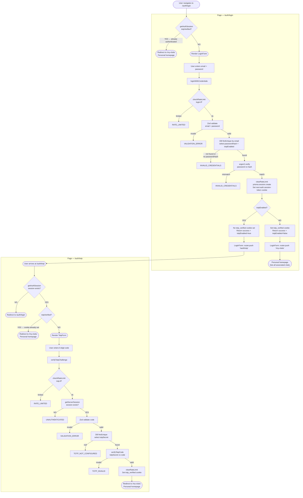
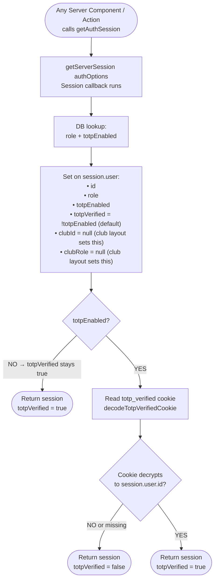
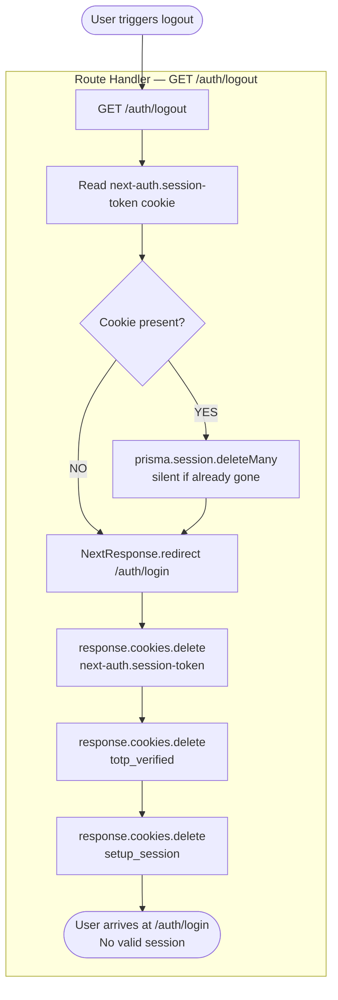
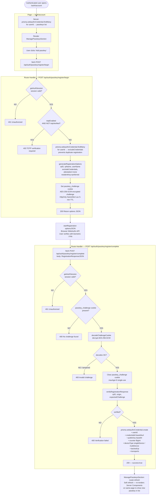

# Authentication System

This document describes the complete authentication architecture for findyour.club.
It covers every flow, the cookie/session state model, and the result of an adversarial security review.

---

## Cookie & Session State Model

Four HttpOnly cookies exist at runtime. Together they determine the fully authenticated state.

| Cookie | Value | Set by | Cleared by |
|---|---|---|---|
| `next-auth.session-token` (dev) / `__Secure-next-auth.session-token` (prod) | random UUID | `setupPassword`, `loginWithCredentials`, `POST /api/auth/passkey/authenticate/complete` | `GET /auth/logout` |
| `totp_verified` | AES-256-GCM encrypted userId | `setupPassword`, `loginWithCredentials` (no TOTP), `verifyTotpChallenge`, `enrollTotp`, `POST /api/auth/passkey/authenticate/complete` | `GET /auth/logout` |
| `setup_session` | AES-256-GCM encrypted `{ userId, exp }` | `GET /auth/magic-link` | `setupPassword` on success, `GET /auth/logout` |
| `passkey_challenge` | AES-256-GCM encrypted challenge (base64 JSON `{ ciphertext, iv }`) | `POST /api/auth/passkey/register/begin`, `POST /api/auth/passkey/authenticate/begin` | Cleared (`maxAge=0`) immediately at the start of each complete handler (single-use) |

`getAuthSession()` in `src/server/auth.ts` is the single authoritative session resolver:
it calls `getServerSession(authOptions)`, then reads and decrypts the `totp_verified` cookie
to set `session.user.totpVerified` in real-time (since Auth.js v4 database sessions cannot be
mutated server-side post-creation).

**Fully authenticated** = valid session token in DB **AND** `totp_verified` cookie decrypts to the same userId.

> **Passkey = MFA-complete:** After successful passkey authentication, `totp_verified` is set
> unconditionally. A passkey is a phishing-resistant authenticator that proves device possession
> (something you have + something you are/know), satisfying both authentication factors simultaneously.
> No separate TOTP challenge is required.

---

## Flow 1 — First Login (Magic Link → Password Setup → TOTP Enrollment)

```mermaid
flowchart TD
    A([Operator provisions\nclub account]) --> B[Generate raw token\nSHA-256 hash, store in DB\nSet magicTokenExp = now + 1h]
    B --> C[/Send magic link email\nwith raw token/]
    C --> D([Club Admin clicks link])
    D --> E

    subgraph MAGIC_LINK["Route Handler — GET /auth/magic-link"]
        E["GET /auth/magic-link?token=raw"]

        E --> H[verifyMagicLinkToken\nSHA-256 hash raw token\nDB lookup by magicToken]

        H --> I{User found?}
        I -- NO, cleared after setup --> J[TOKEN_INVALID]
        I -- YES --> I2{alreadyConfigured?\npasswordHash already set?}
        I2 -- YES --> I2b{getAuthSession\nuser authenticated?}
        I2b -- YES --> I2c([Redirect to /])
        I2b -- NO --> I3([Redirect to /auth/login\nUser already registered\ntoken expiry irrelevant])
        I2 -- NO --> K{magicTokenExp\npast expiry?}
        K -- YES --> L[TOKEN_EXPIRED]
        K -- NO --> M[success + userId\nalreadyConfigured=false]

        J --> N([Redirect to\n/auth/error?error=TokenInvalid])
        L --> O([Redirect to\n/auth/error?error=TokenExpired])

        M --> P[Set encrypted setup_session cookie\nTTL = 30 min\nRedirect to /auth/setup]
    end

    P --> Q

    subgraph SETUP_PAGE["Page — /auth/setup"]
        Q([User arrives at /auth/setup])
        Q --> R{getAuthSession\nalready authenticated?}
        R -- YES --> S([Redirect to /])
        R -- NO --> T{setup_session cookie\nvalid & not expired?}
        T -- NO --> U([Redirect to /auth/login])
        T -- YES --> V([Render SetupPasswordForm])

        V --> W[User submits password]
        W --> X[setupPassword]
        X --> X1{setup_session cookie\ndecodes to userId?}
        X1 -- NO --> Y1[UNAUTHORIZED]
        X1 -- YES --> X2{passwordHash\nalready set?}
        X2 -- YES --> Y2[ALREADY_CONFIGURED]
        X2 -- NO --> X3[Zod validate\npassword strength]
        X3 -- invalid --> Y3[VALIDATION_ERROR]
        X3 -- valid --> X4[HIBP breach check\nk-anonymity SHA-1 prefix]
        X4 -- breached --> Y4[PASSWORD_BREACHED]
        X4 -- clean / unreachable --> X5[argon2.hash password]
        X5 --> X6["prisma.user.update atomic:\n• passwordHash = hash\n• magicToken = null\n• magicTokenExp = null"]
        X6 --> X7[prisma.session.create\nSet next-auth.session-token cookie\nSet totp_verified cookie\nDelete setup_session cookie]
        X7 --> X8([Redirect to /my-clubs\nPersonal homepage])
    end

    X8 --> Z{TOTP enrolled?}
    Z -- YES, future login --> END1([Access granted])
    Z -- NO --> Z1[TotpEnrollmentBanner\nshown on all club pages]
    Z1 --> Z2([User clicks Set up 2FA])
    Z2 --> Z3

    subgraph TOTP_SETUP_PAGE["Page — /auth/totp-setup"]
        Z3["/auth/totp-setup\nno session: redirect login\ntotpEnabled AND NOT totpVerified: redirect /auth/totp\nallows re-enrollment for fully authenticated users"]
        Z3 --> Z4{pendingTotpSecret\nexists in DB?}
        Z4 -- YES, reuse --> Z5
        Z4 -- NO --> Z4a[generateTotpSecret\nstorePendingTotpSecret\nauth-guarded: session.user.id must match]
        Z4a --> Z5[generateTotpUri with email label\nQRCode.toDataURL server-side]
        Z5 --> Z6([Render TotpSetupForm\nQR + secret + code input])

        Z6 --> Z7[User scans QR\nenters 6-digit code]
        Z7 --> Z8[enrollTotp]
        Z8 --> Z8a{Rate limit by IP?}
        Z8a -- YES --> Z8b[RATE_LIMITED]
        Z8a -- NO --> Z8c{"getAuthSession\nsession valid?\nre-enroll: totpEnabled requires totpVerified"}
        Z8c -- NO or totpVerified=false --> Z8d[UNAUTHORIZED]
        Z8c -- YES --> Z8e{pendingTotpSecret\nin DB?}
        Z8e -- NO --> Z8f[UNAUTHORIZED]
        Z8e -- YES --> Z8g[verifyTotpCode\npendingSecret vs code]
        Z8g -- invalid --> Z8h[TOTP_INVALID]
        Z8g -- valid --> Z8i["prisma.user.update atomic:\n• totpSecret = pendingSecret\n• totpEnabled = true\n• pendingTotpSecret = null"]
        Z8i --> Z8j[Set totp_verified cookie]
        Z8j --> Z8k([Redirect to /my-clubs\nPersonal homepage])
    end
```

---

## Flow 2 — Regular Login (Password + TOTP Challenge)

---

## Flow 3 — Session Verification (`getAuthSession`)

---

## Flow 4 — Logout

---

## Flow 5 — Passkey Registration

Passkeys are registered from **Account Settings** (`/auth/account`) by an already-authenticated user.
Registration requires the user to be TOTP-verified (or TOTP not enrolled) — the same guard that
protects all sensitive account mutations.

The challenge cookie is AES-256-GCM encrypted and scoped to 5 minutes. It is cleared immediately
at the start of the complete handler (before verification) to prevent replay.

---

## Flow 6 — Passkey Authentication

Passkey sign-in is available from the login page alongside the password form.
It is a **public endpoint** (no session required). On success, both the session cookie and
`totp_verified` cookie are set unconditionally — passkey authentication satisfies MFA in full.

The counter update and session creation are performed atomically inside a `prisma.$transaction`
to prevent split-brain state (counter updated but no session, or session created but counter stale).

```mermaid
flowchart TD
    A([User navigates to /auth/login]) --> B

    subgraph LOGIN_PAGE["Page — /auth/login"]
        B{getAuthSession\ntotpVerified?}
        B -- YES → already authenticated --> C([Redirect to /my-clubs])
        B -- NO --> D([Render LoginForm + PasskeyButton])
        D --> E[User clicks 'Sign in with passkey']
        E --> F[fetch POST /api/auth/passkey/authenticate/begin\nbody: email optional]
    end

    subgraph BEGIN_AUTH["Route Handler — POST /api/auth/passkey/authenticate/begin"]
        F --> G{email in body?}
        G -- YES --> H[prisma.user.findUnique by email]
        H -- not found → silent:\nno user enumeration --> I[allowCredentials = empty\ndiscoverable credential flow]
        H -- found --> J[prisma.webauthnCredential.findMany\nfor userId → allowCredentials\ncredentialId + transports per credential]
        G -- NO --> I
        J --> K
        I --> K
        K[generateAuthenticationOptions\nrpID, allowCredentials\nuserVerification=preferred]
        K --> L[Set passkey_challenge cookie\nAES-256-GCM encrypted challenge\nHttpOnly SameSite=Lax 5-min TTL]
        L --> M[200 Return options JSON]
    end

    M --> N[startAuthentication optionsJSON\nBrowser WebAuthn API\nUser selects credential + verifies]
    N --> O["fetch POST /api/auth/passkey/authenticate/complete\nbody: AuthenticationResponseJSON"]

    subgraph COMPLETE_AUTH["Route Handler — POST /api/auth/passkey/authenticate/complete"]
        O --> P{passkey_challenge cookie\npresent?}
        P -- NO --> P1[400 No challenge]
        P -- YES --> Q[decodeChallengeCookie\ndecrypt AES-256-GCM]
        Q --> R{decodes OK?}
        R -- NO / tampered --> R1[400 Invalid challenge]
        R -- YES --> S[Clear passkey_challenge cookie\nmaxAge=0 single-use]
        S --> T[prisma.webauthnCredential.findUnique\nby credentialId\ninclude user id, role, totpEnabled]
        T --> U{found?}
        U -- NO --> U1[401 Credential not found]
        U -- YES --> V[verifyAuthenticationResponse\nrpID, origin, expectedChallenge\ncredentialId, publicKey, counter, transports]
        V --> W{verified?}
        W -- NO --> W1[400 Verification failed]
        W -- YES --> X["prisma.$transaction atomic:\n• webauthnCredential.update counter = newCounter\n• session.create sessionToken + expires 30d"]
        X --> Y{transaction OK?}
        Y -- NO --> Y1[500 Failed to create session]
        Y -- YES --> Z[Set next-auth.session-token cookie\nHttpOnly SameSite=Lax 30-day expiry]
        Z --> AA[Set totp_verified cookie\nAES-256-GCM encrypted userId\nPasskey = MFA-complete unconditional]
        AA --> AB[200 — success:true, role]
    end

    AB --> AC[PasskeyButton: window.location.href\nHard navigation — forces full page reload\nso Server Components re-render\nwith new session cookie]
    AC --> AD{role?}
    AD -- OPERATOR --> AE([/admin Operator dashboard])
    AD -- CLUB_ADMIN --> AF([/my-clubs Personal homepage])
```

> **Why `window.location.href` and not `router.push`?**
> `PasskeyButton` uses `fetch()` to set cookies, unlike `LoginForm` which uses a Server Action.
> Server Actions automatically invalidate the Next.js router cache; `fetch()` does not.
> Using `router.push()` would serve a stale cached render of the target page, leaving the
> `DevAuthPanel` (and other Server Components) showing the pre-login state.
> `window.location.href` triggers a full browser navigation, bypassing the cache entirely.
> `ManagePasskeysSection` uses `router.refresh()` (soft) after passkey add/remove because it
> stays on the same page — a soft refresh is sufficient and avoids a visible full reload.

---

## Post-Login Routing — Personal Homepage (`/my-clubs`)

After every successful authentication event (password setup, regular login, TOTP challenge,
passkey authentication), the user is redirected based on their role:

| Role | Redirect |
|---|---|
| `CLUB_ADMIN` | `/my-clubs` |
| `OPERATOR` | `/admin` |

`/my-clubs` queries `ClubMembership.findMany({ where: { userId, status: ACTIVE }, include: { club: true } })` and applies the following routing logic:

| Memberships found | Action |
|---|---|
| 0 | Show empty state (contact operator) |
| 1 | Redirect directly to the club's editor URL (skip club picker) |
| ≥ 2 | Render club picker — lists all clubs with role badge (`Owner` / `Editor`) |

This page is the **only** entry point into club editing. Direct URL access to a club editor (`/ch/[club]/...`) is still valid for bookmarked URLs — the club layout membership guard enforces access control independently.

The authentication model (all flows, cookies, and session state) is fully documented in `AUTHENTICATION.md` (this file).

---

## Adversarial Security Review

### CRITICAL — TOTP Verification Bypass

**Finding:** After `loginWithCredentials`, when `totpEnabled = true`, a valid DB session is created
but no `totp_verified` cookie is set. `LoginForm` redirects the client to `/auth/totp`, but this is a
client-side navigation — not a server-enforced guard. A user can open any club URL directly in the
address bar and skip the TOTP challenge entirely, since:
- No middleware enforces `totpVerified` (proxy.ts is a placeholder — Story 1.4)
- The club layout only shows a `TotpEnrollmentBanner` (checks `totpEnabled`, not `totpVerified`)

**Fix applied:** Added `totpVerified` guard in `src/app/(country)/[club]/layout.tsx`. If a user has
`totpEnabled: true` but `totpVerified: false`, they are redirected server-side to `/auth/totp`.
This is a partial fix — comprehensive middleware coverage of API routes is Story 1.4's responsibility.

---

### MEDIUM — No Rate Limiting on `enrollTotp`

**Finding:** `verifyTotpChallenge` (post-login TOTP challenge) has IP-based rate limiting (5 attempts
per 10-minute window). `enrollTotp` (first-time enrollment) has none. An attacker with a stolen
session token could attempt brute-forcing all 10^6 possible TOTP codes against `enrollTotp`.
Within a 30-second TOTP window, only 1 valid code exists, but there is no server-side limit on attempts.

**Fix applied:** Added `checkRateLimit('totp-enroll:IP')` in `enrollTotp` before session lookup,
using the same 5-attempt-per-10-minute default config as the challenge flow.

---

### MEDIUM — Passkey Counter Update Not Atomic With Session Creation

**Finding (Story 1.6):** Initial implementation updated `webauthnCredential.counter` and created the
session in two separate Prisma calls. A crash between the two operations would leave the counter
updated but no session created, or (less likely) a session created against a stale counter.

**Fix applied:** Both operations are wrapped in `prisma.$transaction(async (tx) => { ... })`.
If either fails, both are rolled back. A `try/catch` around the transaction returns 500 on failure.

---

### LOW — TOTP Code Replay Within Same 30-Second Window

**Finding:** `verifyTotpCode` wraps otplib's `verify()` with no used-token tracking. A valid
6-digit code submitted twice within the same 30-second window would succeed both times. Requires
real-time interception of the code (MITM or shoulder-surfing) and immediate resubmission.

**Decision:** Acceptable for MVP. Fix requires a DB or Redis "used tokens" table with TTL. Deferred
to post-MVP hardening. Risk is negligible in practice: TLS prevents interception; the attacker
must beat the legitimate user to the second submission.

---

### LOW — Logout via GET (CSRF Log-Out)

**Finding:** `GET /auth/logout` is exploitable via a cross-site `` tag,
logging users out without their interaction (logout CSRF). Logout CSRF has no privilege-escalation
impact — the attacker gains nothing except disruption.

**Decision:** Acceptable for MVP. Fix is to use POST + CSRF token or `SameSite=Strict` cookie
(current cookies use `SameSite=Lax`, which blocks cross-site POST but not cross-site GET navigations).

---

### LOW — Passkey Credential Not Found Returns 401

**Finding (Story 1.6):** Initial implementation returned 400 when the credential ID from the
authentication response was not found in the database.

**Fix applied:** Changed to 401 (`Unauthorized`) — 400 (`Bad Request`) implies a malformed request,
whereas 401 correctly signals that authentication failed because the credential is unknown.

---

### LOW — `CONTACT_ENCRYPTION_KEY` Shared Between Auth Cookies and Contact Encryption

**Finding:** The same AES-256-GCM key (`CONTACT_ENCRYPTION_KEY`) encrypts contact form bodies,
`setup_session` cookies, `totp_verified` cookies, and `passkey_challenge` cookies. Key reuse
across contexts is a security smell.

**Analysis:** AES-256-GCM generates a fresh random 96-bit IV per encryption call. Ciphertexts from
different contexts are not interchangeable (different plaintext structure, different consumers).
No cross-context attack vector exists at the protocol level.

**Decision:** Acceptable for MVP. For defence-in-depth, a dedicated `AUTH_COOKIE_SECRET` env var
could be introduced post-MVP.

---

### INFORMATION — Session Created Before TOTP Verified

**Finding:** `loginWithCredentials` creates a full DB session record immediately after password
verification, before TOTP is checked. This means the session exists in the DB with the user's
credentials already verified, but `totpVerified` is `false` in the application layer.

**Analysis:** This is by design for database session strategy with TOTP. The session token is an
opaque random UUID stored in an HttpOnly cookie — it cannot be read by client JS. The `totp_verified`
cookie acts as a second factor gate. Without it, all `getAuthSession()` calls return `totpVerified: false`,
blocking access to protected content (after the club layout fix above).

---

### INFORMATION — Passkey Registration Guarded by TOTP Status

**Design note:** `POST /api/auth/passkey/register/begin` returns 403 if the user has `totpEnabled: true`
but `totpVerified: false`. This prevents a session-hijacking scenario where an attacker with a stolen
(not-yet-TOTP-verified) session token could register their own passkey and escalate to full access.
A user must complete their TOTP challenge before enrolling a passkey.

---

## Security Properties Summary

| Property | Implementation |
|---|---|
| Password storage | Argon2id (default params) |
| Password quality | Zod regex (length 12+, mixed chars) + HIBP k-anonymity breach check |
| Magic link token | Random, SHA-256 hashed in DB, 1-hour TTL, single-use (cleared on password set) |
| Setup session | AES-256-GCM encrypted cookie, 30-minute client TTL |
| Database sessions | UUID session token, 30-day expiry, invalidated on logout |
| TOTP secret | otplib base32, stored encrypted at rest (pending: use dedicated key) |
| TOTP verification | Encrypted userId cookie, 30-day lifetime, re-verified on every request |
| Rate limiting | In-memory sliding window, 5 attempts / 10 min, keyed by IP |
| Brute-force scope | Separate limiters: `login:IP`, `totp:IP`, `totp-enroll:IP` |
| Cookie flags | `HttpOnly`, `SameSite=Lax`, `Secure` (production only) |
| TOTP replay | Not prevented within 30-second window (deferred) |
| Route protection | Club layout enforces `totpVerified`; full middleware in Story 1.4 |
| WebAuthn challenge | AES-256-GCM encrypted HttpOnly cookie, 5-min TTL, single-use (cleared before verification) |
| Passkey credential storage | `credentialId` (base64url), `publicKey` (base64), `counter` (BigInt), `transports` |
| Passkey counter replay | Counter monotonically increasing; verified by `@simplewebauthn/server` on every authentication |
| Passkey = MFA-complete | `totp_verified` cookie set unconditionally after passkey auth — no separate TOTP challenge required |
| Passkey registration guard | 403 if `totpEnabled && !totpVerified` — prevents session-hijack → passkey escalation |
| Passkey atomic session | Counter update + session creation in `prisma.$transaction` — no split-brain on failure |
